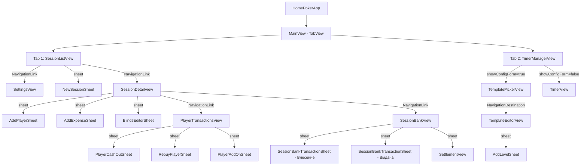
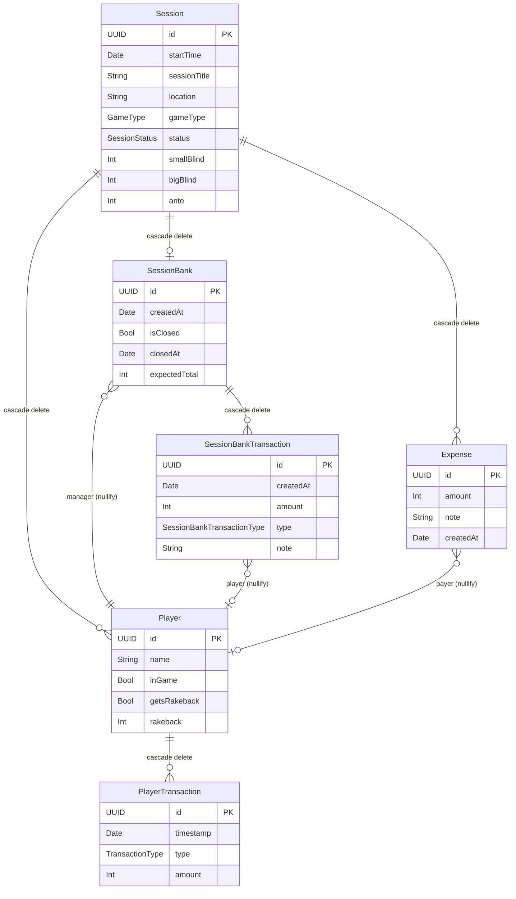
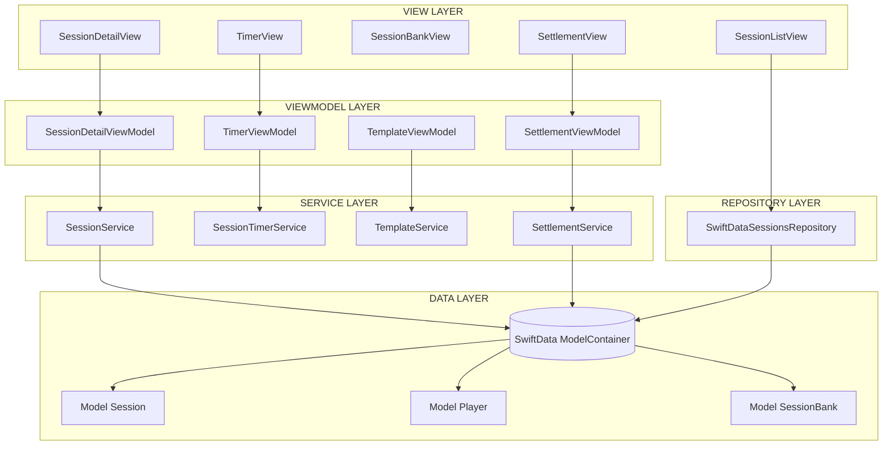
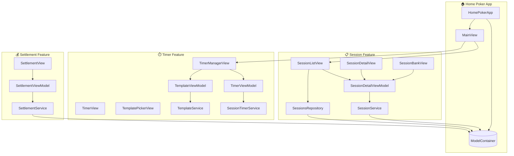

# Home Poker - Архитектура и Flow приложения

## 📱 Обзор приложения

**Home Poker** - приложение для управления домашними покерными сессиями с функциями:
- Учёт игроков, buy-in, cash-out, rebuy
- Управление банком сессии
- Расчёт settlement (кто кому должен)
- Таймер турнира с настраиваемыми блайндами
- Учёт расходов

---

## 🗺️ Навигация приложения



---

## 🗄️ Схема базы данных (SwiftData)



### Описание связей:

- **Session → Players**: Cascade delete - при удалении сессии удаляются все игроки
- **Session → SessionBank**: Cascade delete - при удалении сессии удаляется банк
- **Session → Expenses**: Cascade delete - при удалении сессии удаляются расходы
- **Player → PlayerTransactions**: Cascade delete - при удалении игрока удаляются его транзакции
- **SessionBank → SessionBankTransactions**: Cascade delete - при удалении банка удаляются транзакции
- **SessionBank → Player (manager)**: Nullify - при удалении игрока поле manager становится nil
- **SessionBankTransaction → Player**: Nullify - при удалении игрока связь обнуляется
- **Expense → Player (payer)**: Nullify - при удалении игрока поле payer становится nil

---

## 🏗️ Архитектура слоёв



### Принципы архитектуры:

1. **View Layer** - отображение UI, обработка пользовательского ввода
2. **ViewModel Layer** - управление состоянием, валидация, делегирование к сервисам
3. **Service Layer** - бизнес-логика, операции над моделями
4. **Repository Layer** - абстракция доступа к данным
5. **Data Layer** - SwiftData модели и персистентность

---

## 📂 Структура фич

### **Session Feature**
- **Views**:
  - `SessionListView` - список всех сессий
  - `SessionDetailView` - детали сессии с игроками
  - `SessionBankView` - управление банком
  - `ExpenseDetails` - детали расходов
- **Subviews**:
  - `SessionInfoSection`, `ChipsStatsSection`, `PlayerList`, `PlayerRow`
  - `PlayerTransactionsView` - детальный экран транзакций игрока
- **Sheets**:
  - `NewSessionSheet`, `AddPlayerSheet`, `AddExpenseSheet`, `BlindsEditorSheet`
  - `SessionBankTransactionSheet` - операции с банком (депозит/выплата)
  - `PlayerCashOutSheet`, `RebuyPlayerSheet`, `PlayerAddOnSheet` - операции из PlayerTransactionsView
- **ViewModel**: `SessionDetailViewModel`
- **Service**: `SessionService`
- **Models**: `Session`, `Player`, `PlayerTransaction`, `SessionBank`, `SessionBankTransaction`, `Expense`

### **Timer Feature**
- **Views**:
  - `TimerManagerView` - контейнер таймера
  - `TimerView` - активный таймер
  - `TemplatePickerView` - выбор шаблона
  - `TemplateEditorView` - редактор шаблона
- **Subviews**:
  - `TimerLevelCard`, `TimerControlsPanel`, `NextLevelPreview`, `LevelsListView`
  - `LevelEditView`, `AddLevelSheet`
- **ViewModels**: `TimerViewModel`, `TemplateViewModel`
- **Services**: `SessionTimerService`, `TemplateService`
- **Models**: `TournamentTemplate`, `BlindLevel`, `LevelItem`, `BreakInfo` (не SwiftData, Codable)

### **Settlement Feature**
- **Views**: `SettlementView`
- **ViewModel**: `SettlementViewModel`
- **Service**: `SettlementService`

### **Settings Feature**
- **Views**: `SettingsView`

---

## 🔄 Примеры Data Flow

### Пример 1: Добавление игрока

```swift
// 1. VIEW LAYER
// Пользователь в SessionDetailView нажимает кнопку "Добавить игрока"
// Открывается sheet AddPlayerSheet
// Пользователь вводит: имя "Иван", buy-in 1000₽

// 2. VIEWMODEL LAYER
sessionDetailViewModel.addPlayer(name: "Иван", buyIn: 1000)

// 3. SERVICE LAYER
sessionService.addPlayer(
    to: session,
    name: "Иван",
    buyIn: 1000,
    context: modelContext
)

// Внутри SessionService:
func addPlayer(to session: Session, name: String, buyIn: Int, context: ModelContext) {
    // Создаём нового игрока
    let player = Player(name: name)

    // Создаём транзакцию buy-in
    let transaction = PlayerTransaction(
        timestamp: Date(),
        type: .buyIn,
        amount: buyIn
    )

    // Связываем
    player.transactions.append(transaction)
    session.players.append(player)

    // Вставляем в контекст
    context.insert(player)
    context.insert(transaction)

    // SwiftData автоматически сохраняет при изменении
}

// 4. DATA LAYER
// SwiftData автоматически сохраняет изменения в ModelContainer
// View автоматически обновляется через @Bindable/@Query
```

**Результат**:
- В БД создаётся новый Player с id
- Создаётся PlayerTransaction типа buyIn
- Player добавляется в session.players
- UI обновляется автоматически

---

### Пример 2: Удаление сессии (Cascade Delete Chain)

```swift
// 1. VIEW LAYER
// Пользователь в SessionListView делает swipe для удаления сессии

// 2. REPOSITORY LAYER
repository.deleteSessions([session])

// Внутри SwiftDataSessionsRepository:
func deleteSessions(_ sessions: [Session]) throws {
    sessions.forEach(context.delete)
    try context.save()
}

// 3. SwiftData CASCADE DELETE (автоматически):
// При удалении Session происходит каскадное удаление:

Session (удаляется)
  │
  ├─► Players (cascade delete)
  │     └─► PlayerTransactions (cascade delete)
  │
  ├─► SessionBank (cascade delete)
  │     └─► SessionBankTransactions (cascade delete)
  │           └─► player: Player? (nullify - связь обнуляется)
  │
  └─► Expenses (cascade delete)
        └─► payer: Player? (nullify - связь обнуляется)

// ВАЖНО:
// - При удалении Player, его связи в SessionBankTransaction и Expense
//   становятся nil (deleteRule: .nullify)
// - Это предотвращает краши из-за несуществующих ссылок
```

**Результат**:
- Session удаляется из БД
- Все связанные Players и их транзакции удаляются
- SessionBank и его транзакции удаляются
- Expenses удаляются
- Nullify-связи корректно обнуляются

---

### Пример 3: Расчёт Settlement

```swift
// 1. VIEW LAYER
// Пользователь в SessionBankView нажимает кнопку "Рассчитать Settlement"
// Открывается sheet SettlementView

// 2. VIEWMODEL LAYER
settlementViewModel.calculate()

// Внутри SettlementViewModel:
@Observable
final class SettlementViewModel {
    var result: SettlementResult?
    private let settlementService: SettlementProtocol

    func calculate() {
        result = settlementService.calculate(for: session)
    }
}

// 3. SERVICE LAYER
settlementService.calculate(for: session)

// Внутри SettlementService:
func calculate(for session: Session) -> SettlementResult {
    var balances: [Player: Int] = [:]

    // Шаг 1: Подсчитываем баланс каждого игрока
    for player in session.players {
        let buyIn = player.transactions
            .filter { $0.type == .buyIn || $0.type == .addOn }
            .reduce(0) { $0 + $1.amount }

        let cashOut = player.transactions
            .filter { $0.type == .cashOut }
            .reduce(0) { $0 + $1.amount }

        balances[player] = cashOut - buyIn
    }

    // Шаг 2: Разделяем на должников и кредиторов
    let debtors = balances.filter { $0.value < 0 }
    let creditors = balances.filter { $0.value > 0 }

    // Шаг 3: Генерируем переводы (greedy algorithm)
    var transfers: [Transfer] = []
    var mutableDebtors = debtors
    var mutableCreditors = creditors

    while !mutableDebtors.isEmpty && !mutableCreditors.isEmpty {
        let debtor = mutableDebtors.max(by: { $0.value > $1.value })!
        let creditor = mutableCreditors.max(by: { $0.value < $1.value })!

        let amount = min(abs(debtor.value), creditor.value)

        transfers.append(Transfer(
            from: debtor.key,
            to: creditor.key,
            amount: amount
        ))

        // Обновляем балансы
        mutableDebtors[debtor.key]! += amount
        mutableCreditors[creditor.key]! -= amount

        if mutableDebtors[debtor.key] == 0 {
            mutableDebtors.removeValue(forKey: debtor.key)
        }
        if mutableCreditors[creditor.key] == 0 {
            mutableCreditors.removeValue(forKey: creditor.key)
        }
    }

    return SettlementResult(
        balances: balances,
        transfers: transfers
    )
}

// 4. VIEW LAYER
// SettlementView отображает:
// - Балансы игроков (profit/loss)
// - Список переводов: "Игрок А → Игрок Б: 500₽"
```

**Результат**:
- Система подсчитывает profit/loss каждого игрока
- Генерирует минимальное количество переводов для settlement
- Отображает кто кому должен и сколько

---

## 🛠️ Описание Services

### **SessionService**
**Ответственность**: Бизнес-логика управления сессией

**Методы**:
- `addPlayer(to:name:buyIn:context:)` - добавить игрока с buy-in
- `addOn(for:amount:context:)` - add-on для игрока
- `cashOut(for:amount:context:)` - cash-out игрока
- `rebuyPlayer(for:amount:context:)` - rebuy игрока (возврат в игру с новой закупкой)
- `removePlayer(_:from:context:)` - удалить игрока из сессии
- `removeTransaction(_:from:context:)` - удалить транзакцию игрока
- `ensureBank(for:context:)` - создать банк если нет
- `recordBankTransaction(to:type:amount:note:player:context:)` - записать транзакцию банка
- `removeBankTransaction(_:from:context:)` - удалить транзакцию банка (с пересчетом expectedTotal)
- `addExpense(to:amount:note:payer:context:)` - добавить расход
- `removeExpenses(_:from:context:)` - удалить расходы
- `updateBlinds(for:smallBlind:bigBlind:ante:context:)` - обновить блайнды
- `closeBank(for:context:)` - закрыть банк
- `reopenBank(for:context:)` - открыть банк заново

**Использование**: `SessionDetailViewModel` делегирует все операции этому сервису

---

### **SettlementService**
**Ответственность**: Расчёт settlement между игроками

**Методы**:
- `calculate(for:) -> SettlementResult` - рассчитать балансы и переводы

**Алгоритм**: Greedy algorithm для минимизации количества переводов

**Использование**: `SettlementViewModel` вызывает при открытии SettlementView

---

### **SessionTimerService**
**Ответственность**: Логика таймера турнира

**Методы**:
- `calculateCurrentLevel(items:startTime:currentTime:) -> TimerState` - определить текущий уровень
- `calculateLevelStartTime(items:startTime:targetIndex:) -> Date?` - время начала уровня
- `durationInSeconds(for:) -> Int` - длительность уровня в секундах

**Использование**: `TimerViewModel` использует для управления таймером

---

### **TemplateService**
**Ответственность**: Управление шаблонами турниров

**Методы**:
- `getBuiltInTemplates() -> [TournamentTemplate]` - получить встроенные шаблоны
- `loadUserTemplates() -> [TournamentTemplate]` - загрузить пользовательские шаблоны
- `deleteTemplate(_:)` - удалить шаблон

**Использование**: `TemplateViewModel` использует для работы с шаблонами

---

## 🎯 Описание ViewModels

### **SessionDetailViewModel**
```swift
@Observable
final class SessionDetailViewModel {
    var session: Session
    private let sessionService: SessionServiceProtocol

    // Методы делегируют работу в SessionService
    func addPlayer(name: String, buyIn: Int)
    func cashOutPlayer(_ player: Player, amount: Int)
    func addExpense(amount: Int, note: String, payer: Player?)
    func updateBlinds(small: Int, big: Int, ante: Int)
    // ...
}
```

**Ответственность**:
- Управление состоянием SessionDetailView
- Валидация пользовательского ввода
- Делегирование бизнес-логики в SessionService

---

### **TimerViewModel**
```swift
@Observable
final class TimerViewModel {
    var items: [LevelItem]
    var currentState: TimerState
    var showConfigForm: Bool
    private let timerService: SessionTimerProtocol

    func start()
    func pause()
    func resume()
    func skipToNextLevel()
    // ...
}
```

**Ответственность**:
- Управление состоянием таймера (running/paused/finished)
- Отслеживание текущего уровня и оставшегося времени
- Переключение между конфигурацией и активным таймером

---

### **TemplateViewModel**
```swift
@Observable
final class TemplateViewModel {
    var builtInTemplates: [TournamentTemplate]
    var userTemplates: [TournamentTemplate]
    var editedTemplate: TournamentTemplate?
    var validationWarnings: [String]
    private let templateService: TemplateServiceProtocol

    func loadTemplates()
    func createNewTemplate()
    func saveTemplate()
    func deleteTemplate()
    // ...
}
```

**Ответственность**:
- Управление списком шаблонов
- Редактирование и валидация шаблонов
- Работа с уровнями блайндов

---

### **SettlementViewModel**
```swift
@Observable
final class SettlementViewModel {
    var result: SettlementResult?
    private let settlementService: SettlementProtocol

    func calculate()
}
```

**Ответственность**:
- Запуск расчёта settlement
- Хранение результата для отображения в UI

---

## 📦 Repository

### **SwiftDataSessionsRepository**
```swift
protocol SessionsRepository {
    func fetchSessions() -> [Session]
    func createSession(_: Session) throws
    func deleteSessions(_: [Session]) throws
}

final class SwiftDataSessionsRepository: SessionsRepository {
    private let context: ModelContext

    func fetchSessions() -> [Session] {
        let descriptor = FetchDescriptor<Session>(
            sortBy: [SortDescriptor(\.startTime, order: .reverse)]
        )
        return (try? context.fetch(descriptor)) ?? []
    }

    func createSession(_ session: Session) throws {
        context.insert(session)
        try context.save()
    }

    func deleteSessions(_ sessions: [Session]) throws {
        sessions.forEach(context.delete)
        try context.save()
    }
}
```

**Ответственность**:
- Абстракция доступа к SwiftData
- CRUD операции для Session
- Сортировка и фильтрация

**Использование**: `SessionListView` использует напрямую для списка сессий

---

## 🎨 Полная диаграмма компонентов



---

## 📝 Заметки по архитектуре

### Преимущества текущей архитектуры:

✅ **Разделение ответственности**: View → ViewModel → Service → Data
✅ **Тестируемость**: Services покрыты протоколами, легко мокировать
✅ **Переиспользование**: FormSheetView, сервисы используются в разных местах
✅ **SwiftData integration**: Автоматическая синхронизация UI через @Query/@Bindable
✅ **Cascade deletes**: Корректная обработка связей при удалении

### Потенциальные улучшения:

⚠️ **Schema versioning**: Добавить VersionedSchema и MigrationPlan для безопасных миграций БД
⚠️ **Error handling**: Централизованная обработка ошибок
⚠️ **Logging**: Добавить логирование критичных операций
⚠️ **Repository pattern**: Расширить на все модели, не только Session
⚠️ **Template persistence**: Реализовать полное сохранение пользовательских шаблонов турниров

### Недавние изменения (октябрь 2025):

✅ **Удаление транзакций банка**: Добавлена возможность удалять транзакции банка по свайпу
✅ **Упрощение редактирования шаблонов**: Переход на локальное состояние для редактирования
✅ **Новый алгоритм генерации блайндов**: Улучшенная форма настройки турниров
✅ **Удаление транзакций игроков**: Реализована логика восстановления статуса inGame

---

**Документ обновлён**: 30 октября 2025
**Версия**: 2.1
