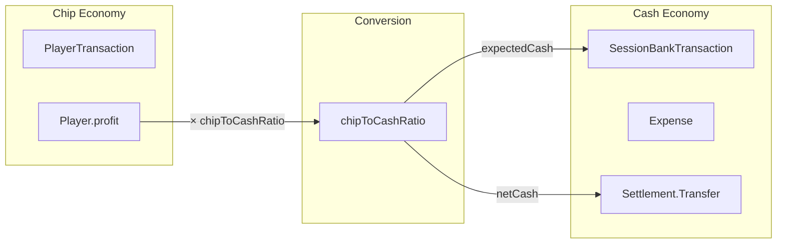

# Home Poker - Расчёты и Экономики

## Оглавление
1. [Две экономики: Фишки и Деньги](#две-экономики-фишки-и-деньги)
2. [Роль chipToCashRatio](#роль-chiptocashratio)
3. [Chip Economy: Игровые транзакции](#chip-economy-игровые-транзакции)
4. [Cash Economy: Реальные деньги](#cash-economy-реальные-деньги)
5. [SessionBank: Расчёты банка](#sessionbank-расчёты-банка)
6. [Settlement: Расчёты между игроками](#settlement-расчёты-между-игроками)
7. [Примеры расчётов](#примеры-расчётов)

---

## Две экономики: Фишки и Деньги

В приложении существуют **две параллельные экономики**:

### 🎰 Chip Economy (Фишки - виртуальная валюта)
- Все игровые операции: buy-in, rebuy, add-on, cash-out
- Результаты игроков (profit/loss) рассчитываются в фишках
- **Единица измерения**: фишки (целое число)
- **Модели**: `PlayerTransaction`, `Player` (buyIn, cashOut, profit)

### 💵 Cash Economy (Наличные - реальные деньги)
- Операции с реальными деньгами: взносы в банк, выдачи из банка
- Расходы на еду, напитки и т.д.
- Переводы между игроками после окончания сессии
- **Единица измерения**: рубли (целое число)
- **Модели**: `SessionBankTransaction`, `Expense`, `Settlement.Transfer`

### ⚖️ Связь между экономиками
Конвертация происходит через параметр **`chipToCashRatio`** в модели `Session`:
```
cash_amount = chip_amount × chipToCashRatio
```

---

## Роль chipToCashRatio

### Что это?
`chipToCashRatio` определяет курс конвертации фишек в рубли.

### Примеры:
- `chipToCashRatio = 1` → 1 фишка = 1 рубль
- `chipToCashRatio = 10` → 1 фишка = 10 рублей
- `chipToCashRatio = 100` → 1 фишка = 100 рублей

### Где используется:
1. **SessionBank расчёты** - конвертация ожидаемых долгов игроков из фишек в рубли
2. **Settlement расчёты** - конвертация результатов из фишек в суммы переводов
3. **Опционально в UI** - для отображения cash-эквивалента фишек

---

## Chip Economy: Игровые транзакции

### PlayerTransaction
Все транзакции игрока хранятся в **фишках**:

```swift
enum TransactionType {
    case buyIn   // Первичная закупка фишек
    case addOn   // Докупка фишек
    case cashOut // Вывод фишек
}
```

### Player - Computed Properties (всё в фишках)

```swift
// Сумма всех закупок (buyIn + addOn)
var buyIn: Int {
    transactions
        .filter { $0.type == .buyIn || $0.type == .addOn }
        .reduce(0) { $0 + $1.amount }
}

// Сумма всех выводов
var cashOut: Int {
    transactions
        .filter { $0.type == .cashOut }
        .reduce(0) { $0 + $1.amount }
}

// Результат игрока в ФИШКАХ
var profit: Int {
    cashOut - buyIn
}

// Текущий баланс для активных игроков
var balance: Int {
    guard inGame else { return 0 }
    return buyIn - cashOut
}
```

### Пример:
Игрок Вася:
- BuyIn: 100 фишек (PlayerTransaction, type: .buyIn)
- AddOn: 50 фишек (PlayerTransaction, type: .addOn)
- CashOut: 80 фишек (PlayerTransaction, type: .cashOut)

Результат:
- `buyIn` = 100 + 50 = **150 фишек**
- `cashOut` = **80 фишек**
- `profit` = 80 - 150 = **-70 фишек** (проигрыш)

---

## Cash Economy: Реальные деньги

### SessionBankTransaction
Транзакции банка хранятся в **рублях**:

```swift
enum SessionBankTransactionType {
    case deposit    // Внесение денег в банк
    case withdrawal // Выдача денег из банка
}
```

### Expense
Расходы на еду, напитки хранятся в **рублях**:

```swift
struct Expense {
    var amount: Int    // В рублях
    var note: String
    var payer: Player?
}
```

### Пример:
Игрок Вася:
- Deposit: 1000₽ (SessionBankTransaction, type: .deposit)
- Deposit: 500₽ (SessionBankTransaction, type: .deposit)

Итого внесено: **1500₽**

---

## SessionBank: Единый финансовый центр

### Задача SessionBank
SessionBank - это **единый источник истины** для всех финансовых расчётов. Банк отслеживает:
- Кто должен банку (проигравшие игроки)
- Кому должен банк (выигравшие игроки + переплатившие)
- Реальные cash-транзакции (deposits/withdrawals)

### Основные методы

#### 1. `amountOwedToBank(for player:)` - Сколько игрок должен банку (рубли)

```swift
func amountOwedToBank(for player: Player) -> Int {
    guard !player.inGame else { return 0 }

    // Если банк что-то должен игроку, то игрок ничего не должен банку
    let bankOwes = amountOwedByBank(for: player)
    if bankOwes > 0 { return 0 }

    let profit = player.cashOut - player.buyIn
    let profitInCash = profit * session.chipsToCashRatio
    let (deposited, withdrawn) = contributions(for: player)
    let netContribution = deposited - withdrawn

    // Игрок должен = abs(убыток) - уже внесённое
    let playerOwes = -profitInCash - netContribution
    return max(playerOwes, 0)
}
```

**Логика:**
1. Рассчитать profit: `cashOut - buyIn` (может быть отрицательным)
2. Конвертировать в рубли: `profitInCash = profit × chipToCashRatio`
3. Вычесть уже внесённое: `debt = -profitInCash - netContribution`
4. Если debt > 0 → игрок должен банку

**Примеры:**
- Игрок проиграл 50₽, внёс 30₽ → должен 20₽
- Игрок проиграл 50₽, внёс 60₽ → должен 0₽
- Игрок выиграл 100₽ → должен 0₽

#### 2. `amountOwedByBank(for player:)` - Сколько банк должен игроку (рубли)

```swift
func amountOwedByBank(for player: Player) -> Int {
    guard !player.inGame else { return 0 }

    let profit = player.cashOut - player.buyIn
    let profitInCash = profit * session.chipsToCashRatio
    let (deposited, withdrawn) = contributions(for: player)
    let netContribution = deposited - withdrawn

    // Банк должен = профит + внесённое игроком - полученное игроком
    let bankOwes = profitInCash + netContribution
    return max(bankOwes, 0)
}
```

**Логика:**
1. Рассчитать profit в рублях: `profitInCash = (cashOut - buyIn) × chipToCashRatio`
2. Рассчитать чистый вклад игрока: `netContribution = deposited - withdrawn`
   - Если игрок **вносил** деньги → `netContribution > 0` → увеличивает долг банка
   - Если игрок **получал** деньги → `netContribution < 0` → уменьшает долг банка
3. Банк должен = `profitInCash + netContribution`

**Примеры:**
- Игрок выиграл 100₽, ничего не вносил: `100 + 0 = 100₽` ✓
- Игрок выиграл 100₽, внёс 5₽: `100 + 5 = 105₽` ✓ (выигрыш + депозит)
- Игрок выиграл 100₽, получил 30₽: `100 + (0-30) = 70₽` ✓ (выигрыш - полученное)
- Игрок проиграл 50₽, внёс 100₽: `-50 + 100 = 50₽` ✓ (переплата)
- Игрок проиграл 50₽, внёс 30₽: `-50 + 30 = -20₽` → `max(-20, 0) = 0₽` ✓

#### 3. Computed Properties

```swift
// Общая сумма, которую банк должен всем игрокам
var totalOwedByBank: Int {
    session.players.reduce(0) { $0 + amountOwedByBank(for: $1) }
}

// Игроки, которые должны банку
var playersOwingBank: [Player] {
    session.players.filter { amountOwedToBank(for: $0) > 0 }
}

// Игроки, кому банк должен (выигравшие + переплатившие)
var playersOwedByBank: [Player] {
    session.players.filter { amountOwedByBank(for: $0) > 0 }
}
```

---

## Архитектурные решения SessionBank

### SessionBank как единый источник истины

SessionBank спроектирован как **единый финансовый центр**, который:

1. **Отслеживает реальные cash-транзакции**
   - Deposits (внесения игроков)
   - Withdrawals (выдачи игрокам)
   - Физический баланс банка (`netBalance = deposited - withdrawn`)

2. **Рассчитывает все долги**
   - Кто должен банку (`playersOwingBank`)
   - Кому должен банк (`playersOwedByBank`)
   - Учитывает как игровые результаты, так и реальные транзакции

3. **Работает независимо от Settlement**
   - Settlement рассчитывает **идеальные** переводы между игроками
   - SessionBank отслеживает **реальные** денежные потоки
   - Они дополняют друг друга, но не пересекаются

### Принципы

**Полная картина долгов:**
- Выигравшие игроки (profit > 0) → банк им должен
- Проигравшие игроки (profit < 0) → они должны банку
- Переплатившие → банк должен вернуть разницу

**Учёт реальных транзакций:**
- Если игрок внёс деньги → увеличивает `netContribution`
- Если игрок получил деньги → уменьшает `netContribution`
- Итоговый долг = `profitInCash + netContribution`

---

## Жизненный цикл транзакций

### Добавление транзакций

**Buy-In / Add-On:**
```swift
// Создаётся PlayerTransaction с типом .buyIn или .addOn
player.inGame = true
```

**Cash-Out:**
```swift
// Создаётся PlayerTransaction с типом .cashOut
player.inGame = false
```

### Удаление транзакций

**Логика восстановления статуса** (`SessionService.removeTransaction`):

```swift
func removeTransaction(_ transaction: PlayerTransaction, from session: Session) {
    // Удаляем из массива
    player.transactions.removeAll { $0.id == transaction.id }

    // Если это был cash-out, проверяем статус игрока
    if transaction.type == .cashOut {
        let hasCashOut = player.transactions.contains { $0.type == .cashOut }
        player.inGame = !hasCashOut  // Игрок активен, если нет других cash-out
    }

    // Пересчитываем expectedTotal
    refreshBankExpectation(for: session)
}
```

**Примеры:**

**Сценарий A: Удаление единственного cash-out**
```
До:
- Транзакции: [buyIn(100), cashOut(150)]
- player.inGame = false

Удаляем cashOut(150):
- Транзакции: [buyIn(100)]
- hasCashOut = false
- player.inGame = true ✓ (игрок вернулся в игру)
```

**Сценарий B: Удаление одного из нескольких cash-out**
```
До:
- Транзакции: [buyIn(100), cashOut(150), rebuy(50), cashOut(80)]
- player.inGame = false

Удаляем cashOut(80):
- Транзакции: [buyIn(100), cashOut(150), rebuy(50)]
- hasCashOut = true (cashOut(150) остался)
- player.inGame = false ✓ (игрок всё ещё завершил после cashOut(150))
```

**Важно:** Статус `inGame` определяется **наличием хотя бы одного** cash-out, а не последней транзакцией по времени.

---

## Расчёт expectedBankTotal

### Назначение

`expectedBankTotal` — это сумма, которую банк **ожидает собрать** с проигравших игроков.

### Формула

```swift
private func expectedBankTotal(for session: Session) -> Int {
    session.players
        .filter { !$0.inGame }              // Только завершившие
        .reduce(0) { partial, player in
            let chipBalance = max(player.buyIn - player.cashOut, 0)  // Только должники
            let cashBalance = chipBalance * session.chipsToCashRatio
            return partial + cashBalance
        }
}
```

### Ключевые моменты

1. **Учитываются только завершившие игроки** (`!player.inGame`)
   - Игроки, которые ещё в игре, не учитываются

2. **Учитываются только должники** (`max(..., 0)`)
   - Выигравшие игроки (cashOut > buyIn) → chipBalance = 0
   - Проигравшие игроки (buyIn > cashOut) → chipBalance > 0

3. **Конвертируется в cash** через `chipToCashRatio`

### Пример

**Сессия с chipToCashRatio = 1:**

| Игрок | buyIn | cashOut | inGame | chipBalance | Учитывается? | Сумма |
|-------|-------|---------|--------|-------------|--------------|-------|
| Вася  | 100   | 200     | false  | 0           | ❌ (выиграл) | 0₽    |
| Петя  | 100   | 50      | false  | 50          | ✓            | 50₽   |
| Коля  | 100   | -       | true   | -           | ❌ (в игре)  | 0₽    |
| Дима  | 100   | 30      | false  | 70          | ✓            | 70₽   |

**expectedBankTotal = 50 + 70 = 120₽**

---

## Детальные сценарии расчётов

### Сценарий A: Выигравший вносит деньги в банк

**Игрок: Алиса**
- BuyIn: 100 фишек
- CashOut: 200 фишек
- Profit: +100 фишек
- chipToCashRatio: 1

**Действия:**
1. Алиса вносит в банк: 50₽

**Расчёты:**
```swift
profitInCash = 100 × 1 = 100₽
netContribution = 50 - 0 = 50₽
bankOwes = 100 + 50 = 150₽
```

**Результат:** Банк должен Алисе **150₽** (её выигрыш 100₽ + её депозит 50₽)

**Объяснение:** Алиса выиграла и при этом ещё внесла деньги. Банк должен вернуть ей и выигрыш, и депозит.

---

### Сценарий B: Проигравший переплачивает

**Игрок: Боб**
- BuyIn: 100 фишек
- CashOut: 50 фишек
- Profit: -50 фишек
- chipToCashRatio: 1

**Действия:**
1. Боб вносит в банк: 100₽

**Расчёты:**
```swift
profitInCash = -50 × 1 = -50₽
netContribution = 100 - 0 = 100₽
bankOwes = -50 + 100 = 50₽
playerOwes = проверка... → bankOwes > 0 → 0₽
```

**Результат:** Банк должен Бобу **50₽** (переплата)

**Объяснение:** Боб должен был внести 50₽, но внёс 100₽. Банк должен вернуть разницу 50₽.

---

### Сценарий C: Проигравший частично платит

**Игрок: Чарли**
- BuyIn: 100 фишек
- CashOut: 50 фишек
- Profit: -50 фишек
- chipToCashRatio: 1

**Действия:**
1. Чарли вносит в банк: 30₽

**Расчёты:**
```swift
profitInCash = -50 × 1 = -50₽
netContribution = 30 - 0 = 30₽
bankOwes = -50 + 30 = -20₽ → max(-20, 0) = 0₽
playerOwes = -(-50) - 30 = 50 - 30 = 20₽
```

**Результат:**
- Банк должен Чарли: **0₽**
- Чарли должен банку: **20₽**

**Объяснение:** Чарли проиграл 50₽, но внёс только 30₽. Ему ещё нужно доплатить 20₽.

---

### Сценарий D: Выигравший получает выплаты

**Игрок: Диана**
- BuyIn: 100 фишек
- CashOut: 150 фишек
- Profit: +50 фишек
- chipToCashRatio: 1

**Действия:**
1. Диана получает из банка: 20₽

**Расчёты:**
```swift
profitInCash = 50 × 1 = 50₽
netContribution = 0 - 20 = -20₽
bankOwes = 50 + (-20) = 30₽
```

**Результат:** Банк должен Диане **30₽** (ещё осталось выплатить)

**Объяснение:** Диана выиграла 50₽, уже получила 20₽. Банк ещё должен ей 30₽.

---

### Сценарий E: Высокий chipToCashRatio

**Игрок: Елена**
- BuyIn: 10 фишек
- CashOut: 15 фишек
- Profit: +5 фишек
- **chipToCashRatio: 100** (1 фишка = 100₽)

**Действия:**
1. Елена ничего не вносит

**Расчёты:**
```swift
profitInCash = 5 × 100 = 500₽
netContribution = 0 - 0 = 0₽
bankOwes = 500 + 0 = 500₽
```

**Результат:** Банк должен Елене **500₽**

**Объяснение:** Даже небольшой выигрыш в 5 фишек превращается в 500₽ при высоком коэффициенте.

---

### Сценарий F: Несколько циклов вход-выход

**Игрок: Фёдор**
- Транзакции:
  1. BuyIn: 100 фишек
  2. CashOut: 150 фишек
  3. Rebuy: 50 фишек
  4. CashOut: 80 фишек
- chipToCashRatio: 1

**Итоговый profit:**
```
Total buyIn = 100 + 50 = 150 фишек
Total cashOut = 150 + 80 = 230 фишек
Profit = 230 - 150 = +80 фишек → +80₽
```

**Действия:**
1. Фёдор ничего не вносит

**Расчёты:**
```swift
profitInCash = 80 × 1 = 80₽
netContribution = 0₽
bankOwes = 80 + 0 = 80₽
```

**Результат:** Банк должен Фёдору **80₽**

---

### Сценарий G: Удаление транзакции cash-out

**Игрок: Георгий**

**До удаления:**
- Транзакции: [buyIn(100), cashOut(150)]
- player.inGame = false
- Profit = +50₽ → банк должен 50₽

**Пользователь удаляет cashOut(150):**

**После удаления:**
- Транзакции: [buyIn(100)]
- player.inGame = true ✓ (вернулся в игру)
- player.cashOut = 0
- Profit = 0 - 100 = -100₽
- Больше не участвует в расчётах expectedTotal (в игре)

**Результат:** Георгий снова активен, его долги/выигрыши не учитываются пока он в игре.

---

### Сценарий H: Полная сессия с 4 игроками

**chipToCashRatio = 1**

| Игрок | buyIn | cashOut | Profit | Deposited | Withdrawn | Банк должен | Игрок должен |
|-------|-------|---------|--------|-----------|-----------|-------------|--------------|
| Анна  | 100   | 200     | +100₽  | 0₽        | 0₽        | **100₽**    | 0₽           |
| Борис | 100   | 50      | -50₽   | 30₽       | 0₽        | 0₽          | **20₽**      |
| Вера  | 100   | 50      | -50₽   | 100₽      | 0₽        | **50₽**     | 0₽           |
| Глеб  | 100   | 100     | 0₽     | 0₽        | 0₽        | 0₽          | 0₽           |

**SessionBank показывает:**
- Получено от игроков: 130₽
- Выдано игрокам: 0₽
- Баланс банка: 130₽
- Должны банку: 20₽ (Борис)
- Банк должен: 150₽ (Анна 100₽ + Вера 50₽)

**Settlement показывает переводы:**
- Борис → Анна: 50₽
- Вера → Анна: 50₽

**Разница:** SessionBank отслеживает реальные депозиты (Вера внесла 100₽), Settlement игнорирует их и показывает идеальные переводы.

---

## SessionBank vs Settlement - сравнение

### Таблица различий

| Аспект | SessionBank | Settlement |
|--------|-------------|------------|
| **Назначение** | Отслеживает реальные денежные потоки | Рассчитывает идеальные переводы |
| **Входные данные** | Chip results + cash deposits/withdrawals | Только chip results |
| **Выходные данные** | Кто должен банку, кому должен банк | Кто кому должен переводить |
| **Учитывает депозиты?** | ✅ Да | ❌ Нет |
| **Учитывает withdrawals?** | ✅ Да | ❌ Нет |
| **Физический баланс** | ✅ Показывает `netBalance` | ❌ Не отслеживает |
| **Оптимизация переводов** | ❌ Не оптимизирует | ✅ Минимизирует кол-во |
| **Независимость** | Работает отдельно | Работает отдельно |

### Когда использовать что?

**SessionBank:**
- Для отслеживания реальных денег в банке
- Для определения кто ещё не внёс деньги
- Для определения кому нужно выплатить
- Для управления физическим балансом банка

**Settlement:**
- Для расчёта минимального количества переводов
- Для показа «кто кому должен» независимо от банка
- Для закрытия сессии без участия централизованного банка

### Пример различия

**Ситуация:**
- Вася выиграл 100₽
- Петя проиграл 50₽
- Коля проиграл 50₽

**SessionBank:**
```
Банк должен: Вася (100₽)
Должны банку: Петя (50₽), Коля (50₽)
```

**Settlement:**
```
Переводы:
- Петя → Вася: 50₽
- Коля → Вася: 50₽
```

**Если Петя внёс 100₽ в банк:**

**SessionBank:**
```
Банк должен: Вася (100₽), Петя (50₽ переплата)
Должны банку: Коля (50₽)
Баланс банка: 100₽
```

**Settlement:** (не изменился - игнорирует депозиты)
```
Переводы:
- Петя → Вася: 50₽
- Коля → Вася: 50₽
```

---

## Settlement: Расчёты между игроками

### Задача SettlementService
Рассчитать **минимальное количество переводов** между игроками для закрытия сессии.

### PlayerBalance
Структура для хранения баланса игрока:

```swift
struct PlayerBalance {
    let player: Player
    let buyIn: Int       // Фишки
    let cashOut: Int     // Фишки
    let netChips: Int    // Результат в фишках (cashOut - buyIn)
    let netCash: Int     // Результат в рублях (netChips × chipToCashRatio)
}
```

### Алгоритм расчёта

```swift
func calculate(for session: Session) -> SettlementResult {
    var balances: [PlayerBalance] = []

    // Шаг 1: Подсчитать результат каждого игрока
    for player in session.players {
        let buyIn = player.buyIn
        let cashOut = player.cashOut
        let netChips = cashOut - buyIn
        let netCash = netChips * session.chipToCashRatio

        balances.append(PlayerBalance(
            player: player,
            buyIn: buyIn,
            cashOut: cashOut,
            netChips: netChips,
            netCash: netCash
        ))
    }

    // Шаг 2: Разделить на должников и кредиторов (в cash)
    let debtors = balances.filter { $0.netCash < 0 }    // Должны заплатить
    let creditors = balances.filter { $0.netCash > 0 }  // Должны получить

    // Шаг 3: Создать переводы (в рублях)
    var transfers: [Transfer] = []
    // ... greedy algorithm для минимизации переводов

    return SettlementResult(balances: balances, transfers: transfers)
}
```

### Transfer (Перевод)
Все переводы между игроками в **рублях**:

```swift
struct Transfer {
    let from: Player  // Кто платит
    let to: Player    // Кто получает
    let amount: Int   // Сумма в РУБЛЯХ
}
```

---

## Примеры расчётов

### Пример 1: Базовый сценарий

**Настройки:**
- `chipToCashRatio = 1` (1 фишка = 1 рубль)

**Игрок Вася:**
- BuyIn: 100 фишек
- CashOut: 150 фишек
- Profit (chips): +50 фишек
- Profit (cash): +50₽

**SessionBank:**
- Expected from Вася: 0₽ (он в плюсе)
- Вася ничего не должен банку

**Settlement:**
- Вася должен получить 50₽ от других игроков

---

### Пример 2: Игрок с переплатой

**Настройки:**
- `chipToCashRatio = 1` (1 фишка = 1 рубль)

**Игрок Вася:**
- BuyIn: 200 фишек (PlayerTransaction)
- CashOut: 150 фишек (PlayerTransaction)
- Profit (chips): -50 фишек
- Expected debt (cash): 50₽

**SessionBank транзакции:**
- Deposit: 1000₽ (внёс в банк)

**SessionBank расчёты:**
```swift
chipBalance = 200 - 150 = 50 фишек (должен)
expectedCash = 50 × 1 = 50₽
deposited = 1000₽
outstanding = max(50 - 1000, 0) = 0₽
overpayment = max(1000 - 50, 0) = 950₽
```

**Результат:**
- Вася переплатил 950₽
- Банк должен вернуть ему 950₽

---

### Пример 3: Курс 1 фишка = 10 рублей

**Настройки:**
- `chipToCashRatio = 10` (1 фишка = 10 рублей)

**Игрок Петя:**
- BuyIn: 100 фишек
- CashOut: 50 фишек
- Profit (chips): -50 фишек
- Profit (cash): -500₽

**SessionBank:**
```swift
chipBalance = 100 - 50 = 50 фишек (должен)
expectedCash = 50 × 10 = 500₽
```

**SessionBank транзакции:**
- Deposit: 200₽ (внёс в банк)

**SessionBank расчёты:**
```swift
outstanding = max(500 - 200, 0) = 300₽
```

**Результат:**
- Петя должен внести ещё 300₽ в банк

---

### Пример 4: Полная сессия с 3 игроками

**Настройки:**
- `chipToCashRatio = 1`

| Игрок | BuyIn (фишки) | CashOut (фишки) | Profit (фишки) | Profit (₽) |
|-------|---------------|-----------------|----------------|-----------|
| Вася  | 100           | 200             | +100           | +100₽     |
| Петя  | 100           | 50              | -50            | -50₽      |
| Коля  | 100           | 50              | -50            | -50₽      |
| **Итого** | **300**   | **300**         | **0**          | **0₽**    |

**Проверка:** Сумма profit всех игроков = 0 (closed economy) ✓

**SessionBank расчёты:**
- Expected from Петя: 50₽
- Expected from Коля: 50₽
- Expected total: 100₽

**Settlement переводы (в рублях):**
1. Петя → Вася: 50₽
2. Коля → Вася: 50₽

**Результат:** Вася получит 100₽ (свой выигрыш)

---

### Пример 5: Сценарий с разным курсом

**Настройки:**
- `chipToCashRatio = 100` (1 фишка = 100 рублей)

**Игрок Дима:**
- BuyIn: 10 фишек (game amount)
- CashOut: 5 фишек
- Profit (chips): -5 фишек
- Profit (cash): -500₽

**SessionBank:**
```swift
chipBalance = 10 - 5 = 5 фишек
expectedCash = 5 × 100 = 500₽
```

**Результат:**
- Дима должен внести 500₽ в банк

---

## Диаграмма конвертации



---

## Правила отображения в UI

### PlayerRow (Строка игрока в списке)
- **buyIn**: показывать в фишках, БЕЗ `.asCurrency()`
- **cashOut**: показывать в фишках, БЕЗ `.asCurrency()`
- **profit**: показывать в фишках, БЕЗ `.asCurrency()`
- Формат: `+50` или `-30` (просто число с знаком)

### ChipsStatsSection (Статистика фишек сессии)
- **totalChips**: показывать в фишках, БЕЗ `.asCurrency()`
- **chipsInGame**: показывать в фишках, БЕЗ `.asCurrency()`
- **chipsWithdrawn**: показывать в фишках, БЕЗ `.asCurrency()`
- Формат: `150 фишек` или просто `150`

### SessionBankView (Экран банка)
- **expectedTotal**: показывать в рублях, С `.asCurrency()`
- **totalDeposited**: показывать в рублях, С `.asCurrency()`
- **remainingToCollect**: показывать в рублях, С `.asCurrency()`
- **overpaymentTotal**: показывать в рублях, С `.asCurrency()`

### SettlementView (Экран расчётов)
- **Player balance**: показывать chip результат И cash результат
  - Формат: `Вася: -50 фишек (-500₽)`
- **Transfers**: показывать ТОЛЬКО в рублях
  - Формат: `Петя → Вася: 500₽`

---

## Ключевые принципы

1. **Chip Economy** = виртуальная игровая валюта (buy-in, cash-out, profit)
2. **Cash Economy** = реальные деньги (банк, расходы, переводы)
3. **chipToCashRatio** = единственный мост между экономиками
4. **SessionBank** работает с cash, но КОНВЕРТИРУЕТ chip результаты игроков
5. **Settlement** показывает переводы ТОЛЬКО в cash
6. **UI**: PlayerRow = chips, SessionBankView = cash

---

**Документ создан**: 29 октября 2025
**Версия**: 1.0
